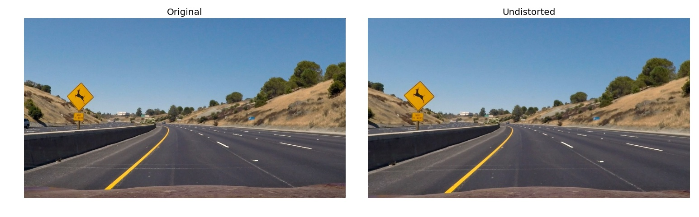
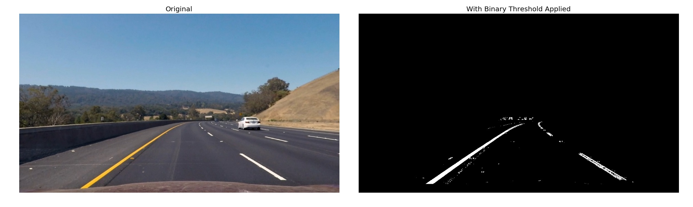
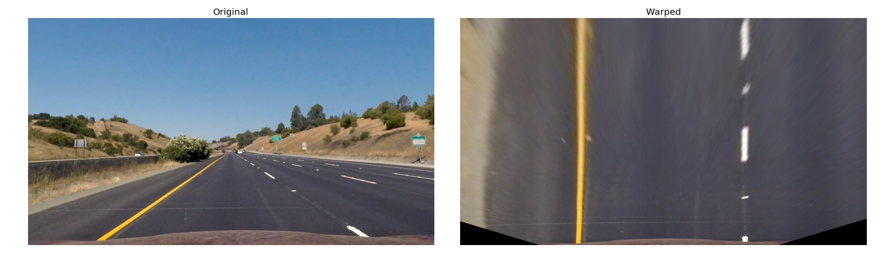
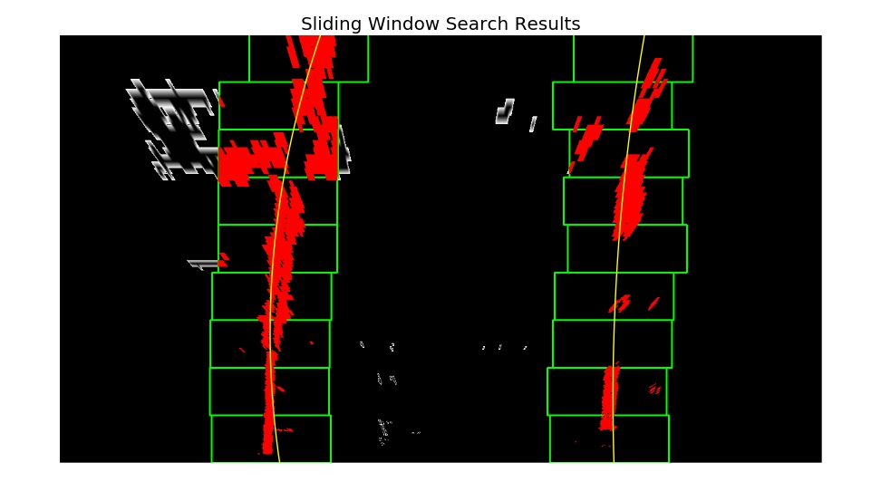
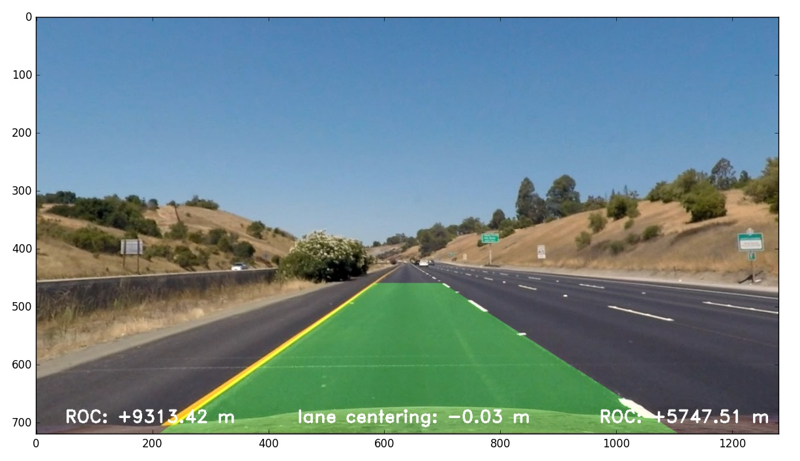

# CarND Project 4 - Advanced Lane Finding

## Problem Statement

The goal of this project is to design an image processing pipeline which detects lane boundaries, curvature, and centering of a car from a video captured by a forward facing camera.

## Approach

The pipeline is composed of the following steps:

* Compute the camera calibration matrix and distortion coefficients given a set of chessboard images.
* Apply a distortion correction to raw images.
* Use color transforms, gradients, etc., to create a thresholded binary image.
* Apply a perspective transform to rectify binary image ("birds-eye view").
* Detect lane pixels and fit to find the lane boundary.
* Determine the curvature of the lane and vehicle position with respect to center.
* Warp the detected lane boundaries back onto the original image.
* Output visual display of the lane boundaries and numerical estimation of lane curvature and vehicle position.

The implementation of the pipeline is in the Jupiter notebook called [Pipeline.ipynb](Pipeline.ipynb). The code corresponding to each section in this report is located under the same heading in the notebook.

## Camera Calibration

Camera calibration was based on a set of chessboard test images located in [`camera_cal`](camera_cal/) folder using OpenCV's `findChessboardCorners()` and `calibrateCamera()` functions.

The function called `get_camera_calibration()` first prepares the "object points", which are the (x, y, z) coordinates of the chessboard corners in the world. Since the chessboard is fixed on the (x, y) plane at z=0 the object points are the same for each calibration image. Thus, objp is just a replicated array of coordinates, and objpoints will be appended with a copy of it every time OpenCV's `findChessboardCorners()` successfully detects all chessboard corners in a test image. Likewise, imgpoints are appended with the (x, y) pixel position of each of the corners that are successfully detected. An image showing a chessboard test images with identified corners highlighted is shown below. Distortion is clearly visible along the top edge of the chessboard.

## Distortion Correction

The camera matrix and the distortion coefficients returned by the `get_camera_calibration()` function are used by `undistort_img()` function to correct an image for distortion computed during calibration.

Here is an example of an image before and after distortion correction.

The result is subtle because the amount of distortion is small, but images are in fact different, note that the rear end of a car in the left image disappears in the right image due to distortion correction.

## Color and Gradient Thresholding

The lane markings are identified in the image based on a combination of thresholding of the saturation channel in the HSL (Hue, Saturation, Lightness) transform of the image as well as the X gradient computed using the Sobel operator. The saturation channel is a good way of isolating the high contrast lane markings independently of the lighting conditions while the x-gradient is a strong indication of the lane markings because of their strong directionality along the y axis. Both the types of thresholding and the threshold limits were arrived at experimentally. Other forms of thresholding were considered, for example gradient direction, gradient magnitude, as well as RGB color channel thresholding but were ultimately rejected. An example of a thresholded binary image is shown below. Note that the lane markings are highly visible.

The implementation of the color and gradient thresholding is done by the `color_and_grandient_threshold()` function which relies on the following helper functions: `hls_select()` to threshold the saturation channel, and `abs_sobel_thresh()` to perform the gradient thresholding based on the sobel operator.

## Perspective Transform

The task of identifying the line is simplified by transforming the image to a 'bird's eye view'. This operation, called the Perspective Transform can be performed by mapping a set of points in the source or warped image to a set of points in a suitably unwarped image. In this case, a set of source points corresponding to a straight section of the road can be mapped to a rectangle in the unwarped space. The source and destination points were selected manually and can be found in `get_perspective_transform()` function which returns a transform matrix `M` that can be applied to images using a helper function `warp()`. The corresponding inverse of the transform matrix is also computed and will be used later for re-warping the images back to the camera view with the lane markings shown. The perspective transform action is shown in the image below, note that the lane markings do indeed appear parallel in the warped image.

## Line Identification and Curve Fitting

In the next step of the pipeline the thresholded images that have been perspective transformed into a bird's eye view are processed in order to find the lane marking of left and right line respectively. There are two ways of of doing that. The first method works well when no previous information about the line locations in the image is available which is the case when line tracking has failed and a search needs to be performed from scratch. This is a more complex and computationally expensive method and will be described first.

The so called sliding window search implemented in `sliding_window_search()` is based on the previously identified starting location at the bottom of the image `x_base`. The x_base is computed using the `find_baseline_x()` function by finding the location of the 'hot' pixels at the bottom of the image searching either left or right half for each line respectively. The search is performed in each of nine bands along the y axis starting at the bottom, in a small x axis neighborhood of +/-100 pixels based on the previously identified x location in the lower window or the x_base in the case of the bottom most window. Once the pixels in all windows are identified they are fitted with a 2nd order polynomial. The radius of curvature (ROC) and the x location of the line are computed using the helper function `roc_and_loc()`. An example of the sliding window search is shown below. The Hot pixels are shown in red, the search boxes in green and the resulting polynomial fit in yellow.

Once the polynomial fit is know the search can be performed in a small x neighborhood around a curve that corresponds to the evaluation of the polynomial along a regularly spaced y axis vector. This implemented in the function called `local_fit_search()`

## Radius of Curvature and Line Location Estimation

Radius of curvature and line location are estimated based on the polynomial fit determined as described above, see function `roc_and_loc()`. Note that these estimates need to be computed in world rather then pixel units to be useful for car navigation. Since we are using a 2nd order polynomial for curve fitting, the conversion needs to be performed in the input space. Radius of curvature is computed using standard [calculus](http://mathworld.wolfram.com/RadiusofCurvature.html), the location of the line is determined by evaluating the polynomial at the bottom edge of the image. 

## Video Frame Qualification and Filtering

The line marking search described above can produce a jittery output due to shifting and occasional misidentification of pixels that form the search data for the curve fitting. The output can be smoothed out identifying and rejecting video frames that cause the line markings to excessively deviate from the previous frames and by filtering. These ideas are based on the assumption that the visual flow changes relatively slowly from frame to frame. 

Each video frame is checked for reasonable line parameter identification using function called `line_qualify()` which looks at the following parameters:

* Steering angle does not change excessively relative to the previous frame
* Steering angle is reasonable
* Line position within the frame does not change excessively relative to the previous frame

The line curvature is converted to steering angle using the bicycle steering model and a small angle approximation. This is done to avoid the excessively large curvature values that correspond to straight or nearly straight lines. The small angle approximation hold true for highway driving but may have to be corrected for slow speed maneuvers. 

The the line passes the checks above it is considered good and it's parameters are filters using a first order low pass filter with a time constant of roughly 0.2 seconds.

If too many "bad" lines are detected in a row, tracking is considered lost and the line identification switches to the sliding window search which re-acquires the line for future tracking.

## Visual Display of the Output

Finally, the line markings and curvature and lane position information is painted back on the original image by first creating a blank image and recording the line markings in the bird's eye view, then performing an inverse perspective transform back to camera view and lastly recording the curvature and lane location text on the combined image. This task is performed by the `draw_overlay()` function. The result is shown below.

## Results

Here is the [resulting video](output_video.mp4) that has been processed with the pipeline.

## Discussion

While the approach described above works reasonably well on the project video it needs to be tuned further to perform well on the challenge video (it misidentifies the cut line in the middle of the lane). This was not attempted. I suspect that signification changes and augmentations will have to be implemented for the pipeline to be able to tackle the harder challenge video.

